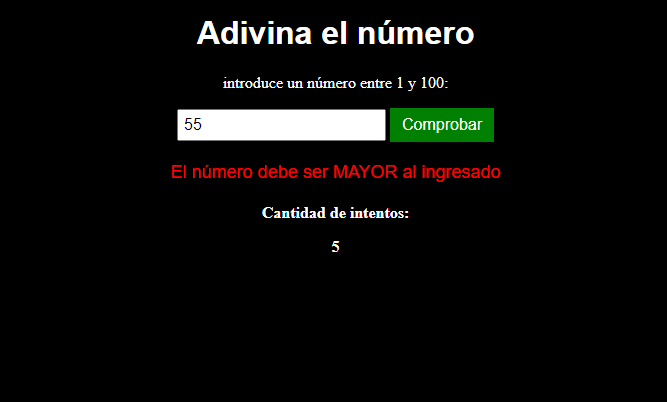

# Juego de Adivinar un Número

¡Bienvenido al Juego de Adivinar un Número! Este es un juego simple y divertido donde tienes que adivinar un número secreto entre 1 y 100. El juego te proporcionará pistas sobre si el número que has intentado es mayor o menor que el número secreto.

## Cómo Jugar

1. Elige un número entre 1 y 100 cuando se te solicite.
2. El juego te proporcionará pistas sobre si el número secreto es mayor o menor que tu elección.
3. Sigue adivinando hasta que encuentres el número secreto.

## Características

- Contador de intentos: El juego realiza un seguimiento de cuántos intentos te toma adivinar el número secreto.
- Pistas útiles: Recibirás pistas sobre si el número secreto es mayor o menor que tu elección actual.
- Divertido y desafiante: ¡Disfruta del proceso de adivinanza y desafía a tus amigos a superar tu récord!

https://ebb08.github.io/Adivina-El-Numero/

